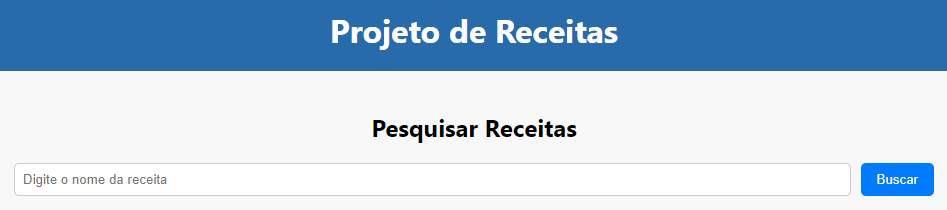

# Projeto de Receitas
Este é um projeto simples de pesquisa de receitas, onde você pode digitar o nome de uma receita em inglês e obter informações sobre ela, como nome, imagem e instruções de preparo.

## Como Funciona

1. Abra um terminal ou prompt de comando na pasta raiz do projeto.
2. Certifique-se de ter o Node.js instalado em seu computador.
3. Execute o seguinte comando para instalar as dependências do projeto:

```
npm install
```

4. Após a instalação das dependências, execute o seguinte comando para iniciar o servidor:

```
npm start
```

5. O aplicativo será aberto automaticamente em seu navegador padrão. Se isso não acontecer, você pode acessá-lo manualmente digitando `http://localhost:3000` em seu navegador.

6. Na página inicial do aplicativo, você verá um campo de entrada de texto onde você pode digitar o nome de uma receita em inglês.
7. Digite o nome da receita no campo de entrada e pressione o botão "Buscar".
8. As informações da receita, como nome, imagem e instruções de preparo, serão exibidas abaixo do botão de busca.

Lembre-se de que o projeto foi desenvolvido para buscar receitas em inglês. Certifique-se de digitar o nome da receita nesse idioma para obter resultados adequados.

## Personalização

Você pode personalizar a aparência do aplicativo ajustando as regras de estilo no arquivo `src/components/RecipeSearch.css`.

## Imagem do projeto


